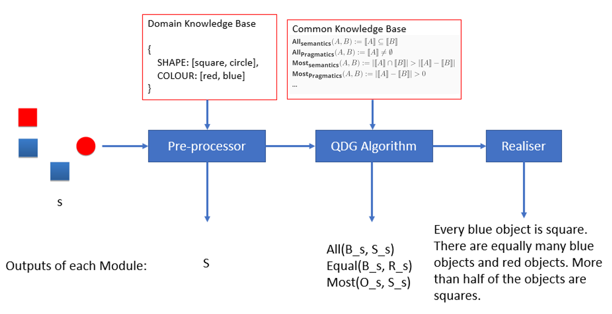

# Quantified Description Generation

Code for the paper *Generating Quantified Descriptions of Abstract Visual Scenes* (LINK TBC), in the proceeding of 12th International Conference on Natural Lnaguage Generation (INLG 2019).

## Introduction

This code inplements two quantified description generation (QDG) algorithms, namely, the incremental algorithm and the greedy algorithm, for simulating human production of quantified expressions, and for reproducing descriptions in the [QTUNA dataset](https://github.com/a-quei/quantified-description-generation). 

<p align="center"></p> 

Given a target scene with its domain knowledge, the generator constructs a set containing all possible scenes in the same domain as the target scene. The generator then calls a QDG algorithm to construct a description containing a set of QEs. The algorithm selects from a set of candidate quantified patterns, based on the common knowledge by mimicking how human beings did so in the QTUNA experiment. Finally, a simple template-based surface realiser is called to map the description (in logical form) into natural language text.

## Usage

To run the code, we, in the first place, need to define the scene in the `generator.py`. For example, 
```
s = {"BS": 0, "BC": 1, "RS": 0, "RC":3}
``` 
stands for a scene with one blue circle and three red circles. To run the DQG algorithms, use the following command:
```
python3 generator.py
```

#### Example Output

By runing the code, we get outputs like:
```
IA: (True) Every object is circle. Most of the objects are red circles.
Greedy: (True) Most of the objects are red circles. There are only circles.
```
where the `True` mark in the brackets indicates the generated description is logical complete.

## Citation

TBC


